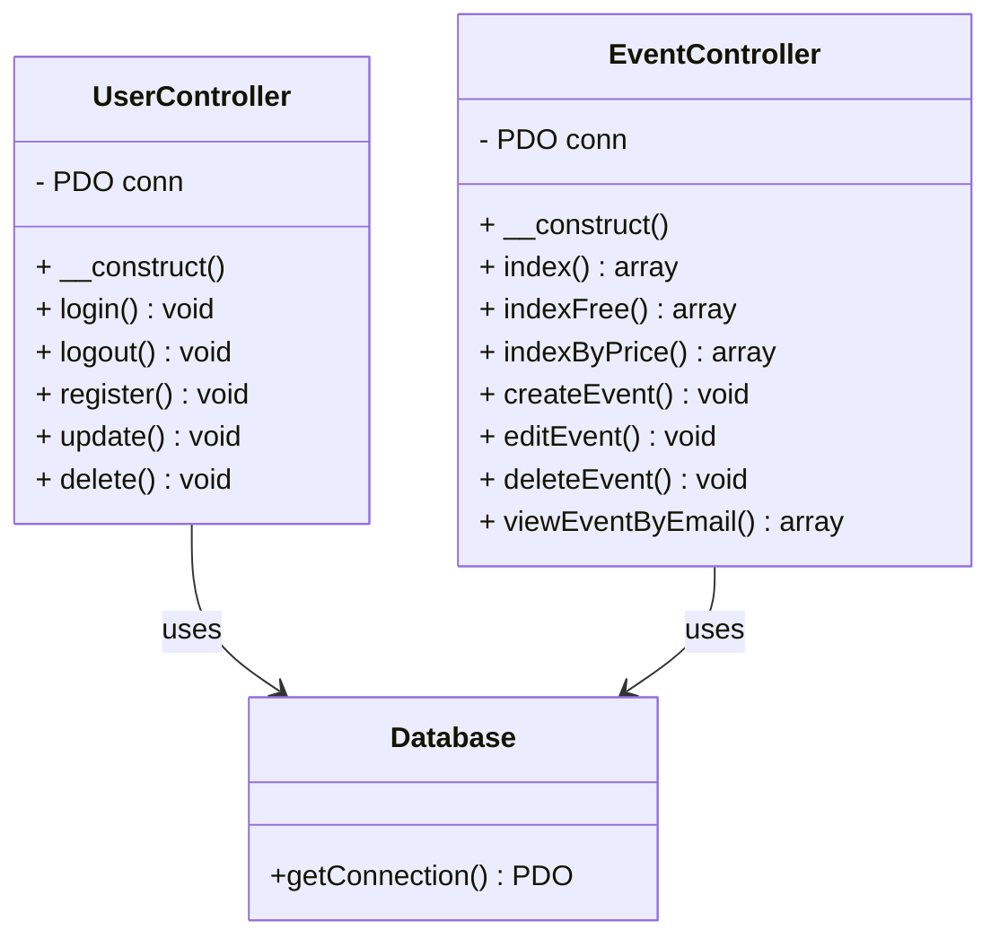

# 📖 Introducción
**`Event Hunters`** es una aplicación web diseñada para descubrir, comparar y reservar eventos de experiencias inmersivas en Cataluña. Nuestro objetivo es ofrecer a los usuarios las mejores ofertas, reseñas transparentes y la posibilidad de crear grupos para disfrutar de aventuras únicas. Ideal para quienes buscan salir de su zona de confort y explorar nuevas actividades culturales, educativas o recreativas.

## 📊 Diagrama de Clases

---
